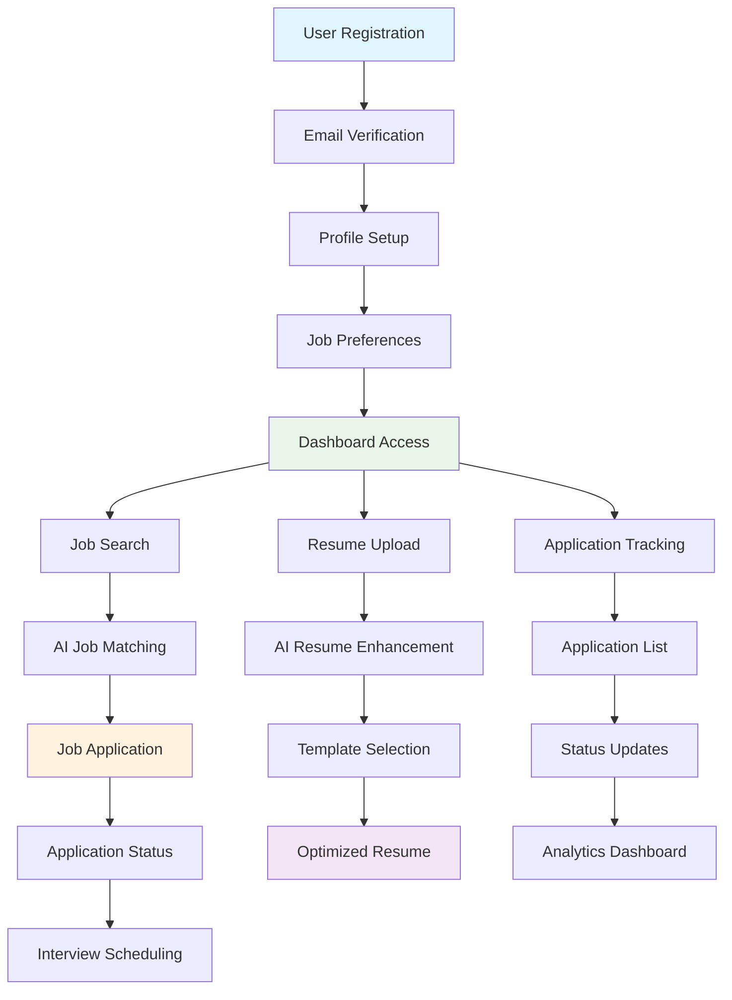
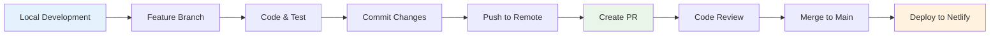
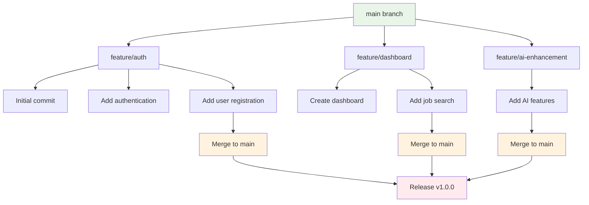

# My Job Search Agent 🤖

This is not part of Hackathorn. It is for production release

An AI-powered job search application built with NEXT_PUBLIC.js, React, and TypeScript that helps users find, apply to, and manage job applications efficiently.

## 🚀 Features

- **AI-Enhanced Job Search**: Intelligent job matching based on user preferences
- **Resume Optimization**: AI-powered resume enhancement and template selection
- **Application Tracking**: Comprehensive dashboard to track job applications
- **Profile Management**: User profile creation and management
- **Authentication**: Secure login/registration with Firebase
- **Responsive Design**: Modern UI built with Tailwind CSS
- **Real-time Updates**: Live application status tracking

## 🛠️ Tech Stack

- **Frontend**: React 18 + TypeScript
- **Framework**: NEXT_PUBLIC.js
- **Styling**: Tailwind CSS
- **Authentication**: Firebase
- **Routing**: React Router DOM
- **Icons**: Lucide React
- **Date Handling**: date-fns
- **Phone Validation**: libphonenumber-js
- **Deployment**: Netlify

## 📋 Prerequisites

Before running this project, make sure you have:

- **Node.js** (version 18 or higher)
- **npm** or **yarn** package manager
- **Git** for version control
- **Firebase account** (for authentication)

## ⚡ Quick Start

### 1. Clone the Repository

```bash
# Clone the repository
git clone https://github.com/agilepartners-ai/MyJobSearchAgent.git

# Navigate to project directory
cd MyJobSearchAgent
```

### 2. Install Dependencies

```bash
# Install all dependencies
npm install


```

### 3. Environment Setup

Create a `.env` file in the root directory and add your Firebase configuration:

```env
NEXT_PUBLIC_FIREBASE_API_KEY=your_api_key
NEXT_PUBLIC_FIREBASE_AUTH_DOMAIN=your_auth_domain
NEXT_PUBLIC_FIREBASE_PROJECT_ID=your_project_id
NEXT_PUBLIC_FIREBASE_STORAGE_BUCKET=your_storage_bucket
NEXT_PUBLIC_FIREBASE_MESSAGING_SENDER_ID=your_sender_id
NEXT_PUBLIC_FIREBASE_APP_ID=your_app_id
NEXT_PUBLIC_JSEARCH_API_KEY=Your jsearch api
NEXT_PUBLIC_JSEARCH_API_HOST=your host api
```

### 4. Run Development Server

```bash
# Start development server
npm run dev

# Or using yarn
yarn dev
```

The application will be available at `http://localhost:5173`

## 🏗️ Build and Deployment

### Build for Production

```bash
# Create production build
npm run build

# Or using yarn
yarn build
```

### Preview Production Build

```bash
# Preview the production build locally
npm run preview

# Or using yarn
yarn preview
```

## 📁 Project Structure

```
MyJobSearchAgent/
├── public/                 # Static assets
├── src/
│   ├── components/        # React components
│   │   ├── auth/         # Authentication components
│   │   ├── dashboard/    # Dashboard components
│   │   ├── forms/        # Form components
│   │   └── applications/ # Job application components
│   ├── hooks/            # Custom React hooks
│   ├── lib/              # External library configurations
│   ├── services/         # API and service functions
│   ├── types/            # TypeScript type definitions
│   ├── utils/            # Utility functions
│   └── test/             # Test files
├── package.json          # Dependencies and scripts
├── NEXT_PUBLIC.config.js        # NEXT_PUBLIC.js configuration
├── tailwind.config.js    # Tailwind CSS configuration
├── tsconfig.json         # TypeScript configuration
└── netlify.toml          # Netlify deployment configuration
```

## 🌿 Git Workflow & CLI Commands

### Branch Management

```bash
# Check current branch
git branch

# Create and switch to new feature branch
git checkout -b feature/your-feature-name

# Switch to existing branch
git checkout branch-name

# Create new branch from current branch
git branch new-branch-name

# Delete local branch
git branch -d branch-name

# Delete remote branch
git push origin --delete branch-name
```

### Basic Git Operations

```bash
# Check status
git status

# Add files to staging
git add .                    # Add all files
git add filename            # Add specific file
git add *.js               # Add all JS files

# Commit changes
git commit -m "Your commit message"

# Push to remote branch
git push origin branch-name

# Pull latest changes
git pull origin branch-name
# push from branch if errors 
git push --set-upstream origin branch-name

# Fetch all branches
git fetch --all
```

### Working with Feature Branches

```bash
# 1. Create feature branch
git checkout -b feature/job-search-enhancement

# 2. Make your changes and commit
git add .
git commit -m "feat: add AI-powered job matching algorithm"

# 3. Push feature branch to remote
git push origin feature/job-search-enhancement

# 4. Create Pull Request (via GitHub/GitLab interface)

# 5. After PR approval, merge to main
git checkout main
git pull origin main
git merge feature/job-search-enhancement

# 6. Push updated main
git push origin main

# 7. Delete feature branch (optional)
git branch -d feature/job-search-enhancement
git push origin --delete feature/job-search-enhancement
```

### Deployment to Main Branch

```bash
# Complete workflow for pushing to main
git checkout main
git pull origin main
git merge your-feature-branch
git push origin main

# Or using rebase for cleaner history
git checkout main
git pull origin main
git checkout your-feature-branch
git rebase main
git checkout main
git merge your-feature-branch
git push origin main
```

### Advanced Git Commands

```bash
# Stash changes temporarily
git stash
git stash pop

# Reset to previous commit
git reset --hard HEAD~1

# View commit history
git log --oneline

# Create tag
git tag v1.0.0
git push origin v1.0.0

# Cherry-pick specific commit
git cherry-pick commit-hash

# Rebase interactive (clean up commits)
git rebase -i HEAD~3
```

## 🔧 Development Commands

```bash
# Install dependencies
npm install

# Start development server
npm run dev

# Build for production
npm run build

# Preview production build
npm run preview

# Run linter
npm run lint

# Run linter with auto-fix
npm run lint --fix
```

## 🔄 Application Workflow




## 🔄 Development Workflow



## 🔄 Git Branching Strategy



## 🚀 Deployment Configuration

### Deploy to Netlify

The project is configured for automatic deployment to Netlify:

1. **Connect Repository**: Link your GitHub repository to Netlify
2. **Build Settings**: 
   - Build command: `npm run build`
   - Publish directory: `dist`
   - Node version: 18
3. **Environment Variables**: Add your Firebase config to Netlify environment variables:
   - `NEXT_PUBLIC_FIREBASE_API_KEY`
   - `NEXT_PUBLIC_FIREBASE_AUTH_DOMAIN`
   - `NEXT_PUBLIC_FIREBASE_PROJECT_ID`
   - `NEXT_PUBLIC_FIREBASE_STORAGE_BUCKET`
   - `NEXT_PUBLIC_FIREBASE_MESSAGING_SENDER_ID`
   - `NEXT_PUBLIC_FIREBASE_APP_ID`
   - `NEXT_PUBLIC_JSEARCH_API_KEY`
   - `NEXT_PUBLIC_JSEARCH_API_HOST`

### Manual Deployment

```bash
# Build and deploy manually
npm run build
npx netlify deploy --prod --dir=dist
```

## 🧪 Testing

```bash
# Run tests (when configured)
npm test

# Run tests in watch mode
npm test -- --watch

# Run tests with coverage
npm test -- --coverage
```

## 🔍 Debugging

```bash
# Start with debugging enabled
npm run dev -- --debug

# Check for TypeScript errors
npx tsc --noEmit

# Analyze bundle size
npm run build -- --analyze
```

## 🚀 Performance Optimization

- **Code Splitting**: Implemented with React.lazy()
- **Image Optimization**: WebP format with fallbacks
- **Bundle Analysis**: Use `npm run build -- --analyze`
- **Caching**: Service worker for offline capabilities
- **Minification**: Automatic with NEXT_PUBLIC.js build

## 🔒 Security

- **Environment Variables**: All sensitive data in `.env`
- **Firebase Security Rules**: Configured for user data protection
- **HTTPS**: Enforced in production
- **Content Security Policy**: Configured in Netlify
- **Input Validation**: Zod schema validation

## 📱 Browser Support

- Chrome (latest)
- Firefox (latest)
- Safari (latest)
- Edge (latest)

## 🤝 Contributing

1. Fork the repository
2. Create your feature branch (`git checkout -b feature/amazing-feature`)
3. Commit your changes (`git commit -m 'Add some amazing feature'`)
4. Push to the branch (`git push origin feature/amazing-feature`)
5. Open a Pull Request

## 📄 License

This project is licensed under the MIT License - see the LICENSE file for details.

## 🆘 Support

If you encounter any issues:

1. Check the [Issues](../../issues) page
2. Create a new issue with detailed description
3. Include error logs and environment details

## 🔮 Future Enhancements

- [ ] AI-powered interview preparation
- [ ] Salary negotiation assistant
- [ ] Company culture matching
- [ ] Network analysis and recommendations
- [ ] Mobile application
- [ ] LinkedIn integration
- [ ] Email automation for follow-ups

---

**Happy Job Hunting!** 🎯
